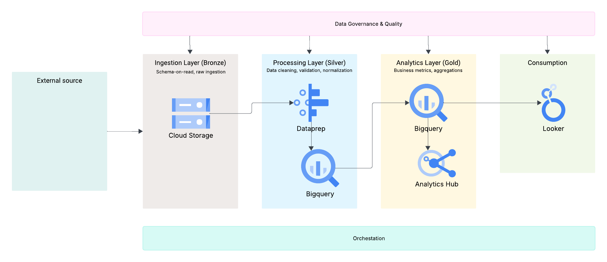

# ☁️ London Air Quality Data Platform (GCP) 

**From Raw Data to Actionable Insights**

## 📌 Overview

Air pollution is a major concern in London, affecting public health and urban planning decisions. However, analysing air quality data across multiple sources can be complex and fragmented.

This project transforms a previous [academic analysis](https://github.com/Izel/LdnAirAnalysis) into a production-style data platform that ingests, processes, and models air quality data to generate clear, actionable insights.

---

## 🎯 Objective

To design and implement a scalable data platform that:

* Ingests raw environmental data
* Cleans and structures it for analysis
* Produces meaningful insights for decision-making

---

## 🏗️ Architecture

The platform follows a layered (medallion-style) architecture:

* **Bronze layer** → Raw ingested data
* **Silver layer** → Cleaned and standardized data
* **Gold layer** → Aggregated, analytics-ready data

---

## ⚙️ Tech Stack

* Google Cloud Platform (GCP)
* Cloud Storage (data ingestion)
* BigQuery (data processing & modelling)
* SQL / Python
* Looker Studio (visualisation)

---

## 🔄 Data Pipeline

1. Data ingestion from source files / APIs
2. Storage in raw format (Bronze)
3. Data cleaning and transformation (Silver)
4. Aggregation and modelling (Gold)
5. Visualisation and insights

---

## 🛡️ Data Governance

This platform includes a lightweight data governance approach to ensure data quality, consistency, and usability:

- Data validation and cleaning in the Silver layer  
- Structured and documented datasets  
- Controlled access to data resources  
- Clear data flow across layers  

This approach improves trust and supports better decision-making.

---

## 🔍 Key Insights

(Example — to be updated with real results)

* Pollution levels vary significantly by location and time
* Certain pollutants show strong seasonal patterns
* Urban areas exhibit higher concentration peaks

---

## 💡 Business Value

This platform demonstrates how environmental data can be transformed into actionable insights to support:

* Public policy decisions
* Urban planning
* Environmental monitoring strategies

---

## 🧠 Design Decisions & Trade-offs

* **BigQuery** chosen for scalability and simplicity
* **Layered architecture** for clarity and maintainability
* Trade-off: less control vs faster implementation

---

## 🚀 Future Improvements

* Real-time data ingestion
* Advanced forecasting models
* Integration with additional data sources
* Migration to alternative platforms (e.g., Databricks)

---

## 📚 What I Learned

* Designing data systems is about trade-offs, not perfection
* Clear structure improves both scalability and usability
* Communicating results is as important as building pipelines

---

## 🔗 Previous Version

This project is based on my original academic work:
(https://github.com/Izel/LdnAirAnalysis)

---

## ✨ Author

Gloria Meneses

I focus on Data architectures to transform complex data into clear insights and practical data solutions.
